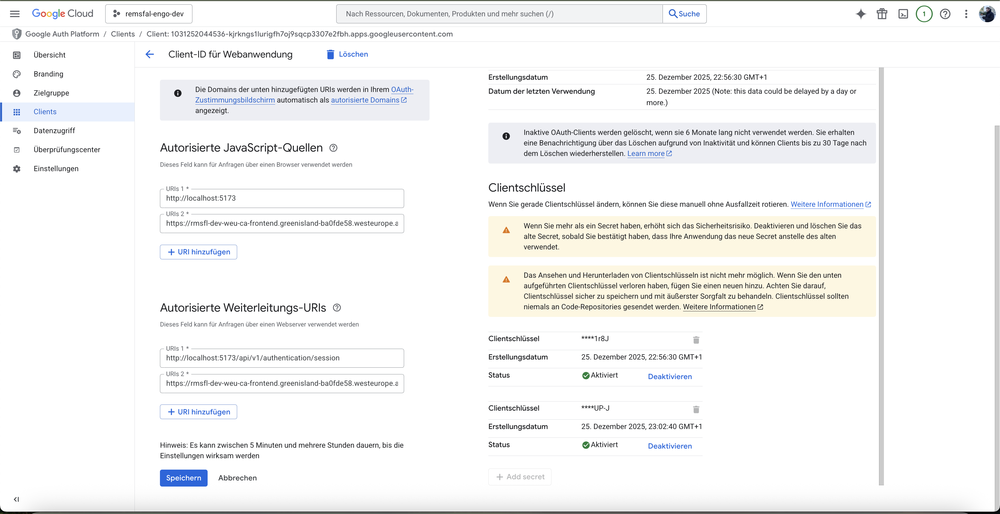

# Setup-Anleitung - REMSFAL Azure Deployment

Diese Anleitung beschreibt den vollständigen Deployment-Prozess der REMSFAL-Anwendung auf Azure.

---

## Inhaltsverzeichnis

1. [Voraussetzungen](#voraussetzungen)
2. [Konfigurationsvariablen definieren](#konfigurationsvariablen-definieren)
3. [Schritt 1: Google OAuth konfigurieren](#schritt-1-google-oauth-konfigurieren)
4. [Schritt 2: Vorbereitende Azure-Ressourcen erstellen](#schritt-2-vorbereitende-azure-ressourcen-erstellen)
5. [Schritt 3: Docker-Images bauen und pushen](#schritt-3-docker-images-bauen-und-pushen)
6. [Schritt 4: Terraform-Infrastruktur deployen](#schritt-4-terraform-infrastruktur-deployen)
7. [Schritt 5: Container Apps Image-Update](#schritt-5-container-apps-image-update-bei-späteren-deployments)
8. [Schritt 6: Anwendung testen](#schritt-6-anwendung-testen)
9. [Schritt 7 (Optional): Custom Domain einrichten](#schritt-7-optional-custom-domain-einrichten)

---

## Voraussetzungen

### Erforderliche Tools

| Tool | Version | Installation (macOS) |
|------|---------|---------------------|
| **Azure CLI** | >= 2.50 | `brew install azure-cli` |
| **Terraform** | >= 1.5 | `brew install terraform` |
| **Docker** | Latest | [Docker Desktop](https://www.docker.com/products/docker-desktop/) |
| **Git** | Latest | `brew install git` |
| **Maven** | >= 3.8 | `brew install maven` |
| **Node.js** | >= 18 | `brew install node` |

### Versionen verifizieren

```bash
az --version          # Azure CLI
terraform --version   # Terraform
docker --version      # Docker
mvn --version         # Maven
node --version        # Node.js
```

### Azure-Konto einrichten

1. **Azure-Konto erstellen:** [portal.azure.com](https://portal.azure.com)
2. **Subscription erstellen:** Free Tier oder Pay-As-You-Go
3. **Azure CLI anmelden:**

```bash
# Azure Login
az login

# Subscription setzen
az account set --subscription "<subscription-id>"

# Aktuelle Subscription verifizieren
az account show
```

---

## Konfigurationsvariablen definieren

Definieren Sie zuerst alle nötigen Variablen für die Session. Diese werden in den nachfolgenden Befehlen verwendet:

```bash
export LOCATION="westeurope"
export ENVIRONMENT="dev"
export IAC_RESOURCE_GROUP="remsfal-iac-rg"
export IAC_STORAGE_ACCOUNT="remsfalsa"
export IAC_CONTAINER_NAME="tfstate"
export PROJECT_PREFIX="rmsfl"
export POSTGRES_ADMIN_USERNAME="psqladmin"
export POSTGRES_ADMIN_PASSWORD="EinSicheresPasswort123!"
```

```bash
export ACR_NAME="${PROJECT_PREFIX}${ENVIRONMENT}weuacr"
```

```bash
echo "Konfigurationsvariablen gesetzt:"
echo "  Location: ${LOCATION}"
echo "  Environment: ${ENVIRONMENT}"
echo "  IaC Resource Group: ${IAC_RESOURCE_GROUP}"
echo "  IaC Storage Account: ${IAC_STORAGE_ACCOUNT}"
echo "  ACR Name: ${ACR_NAME}"
```

> **Hinweis:** Diese Variablen bleiben nur für die aktuelle Terminal-Session gültig.
> **Hinweis:** Der Storage Account Name und ACR Name müssen global eindeutig sein und sollten angepasst werden.

---

## Schritt 1: Google OAuth konfigurieren

> **Wichtig:** Google OAuth muss **vor** dem Image-Build konfiguriert werden, da die Credentials in `application.properties.azure` eingetragen werden müssen.

### 1.1 Google Cloud Console

1. Öffnen Sie die [Google Cloud Console](https://console.cloud.google.com/)
2. Erstellen Sie ein neues Projekt oder wählen Sie ein bestehendes
3. Navigieren Sie zu **APIs & Services → Credentials**

### 1.2 OAuth Consent Screen konfigurieren

1. Klicken Sie auf **OAuth consent screen**
2. Wählen Sie **External** (für öffentliche Nutzung)
3. Füllen Sie die erforderlichen Felder aus:
    - App name: `REMSFAL`
    - User support email: Ihre E-Mail
    - Developer contact: Ihre E-Mail

### 1.3 OAuth 2.0 Client-ID erstellen

1. Klicken Sie auf **Credentials → Create Credentials → OAuth 2.0 Client IDs**
2. Application type: **Web application**
3. Name: `REMSFAL Azure`
4. Authorized JavaScript origins:
    ```
    http://localhost:5173
    und
    https://rmsfl-dev-weu-ca-frontend.<aca-domain>
    ```
5. Authorized redirect URIs:
    ```
    http://localhost:5173/api/v1/authentication/session
    und
    https://rmsfl-dev-weu-ca-frontend.<aca-domain>/api/v1/authentication/session
    ```

> **Hinweis:** Die Container Apps Domain (`<aca-domain>`) erhalten Sie nach dem Terraform-Deployment aus dem Output `container_app_urls`. Sie können die URIs auch später in der Google Console anpassen.

### 1.4 Credentials in application.properties.azure eintragen

Öffnen Sie die Datei `remsfal-backend/remsfal-services/remsfal-platform/src/main/resources/application.properties.azure` und tragen Sie Ihre Google OAuth Credentials ein:

```properties
# REMSFAL Google OAUTH configuration
de.remsfal.auth.oidc.client-id=<Ihre-client-id>
de.remsfal.auth.oidc.client-secret=<Ihr-client-secret>
de.remsfal.auth.session.secret=<ein-zufälliger-secret-string>
```

> **Hinweis:** Die Datei `application.properties.azure` wird beim Docker-Build in das Image eingebaut. Ändern Sie diese Werte **vor** dem Image-Build in Schritt 3.

---

## Schritt 2: Vorbereitende Azure-Ressourcen erstellen

### 2.1 Repository klonen

```bash
git clone -b Enrico-Goerlitz#644 https://github.com/enricogoerlitz/remsfal-backend.git
git clone -b Enrico-Goerlitz#45 https://github.com/enricogoerlitz/remsfal-ocr.git
git clone -b Enrico-Goerlitz#828 https://github.com/enricogoerlitz/remsfal-frontend.git

cd remsfal-backend/iac/azure/terraform
```

### 2.2 Terraform Backend vorbereiten

Das Terraform State wird in Azure Blob Storage gespeichert. Erstellen Sie zuerst die Backend-Ressourcen:

```bash
# Resource Group für Terraform State
az group create \
  --name ${IAC_RESOURCE_GROUP} \
  --location ${LOCATION}

# Storage Account für State
az storage account create \
  --name ${IAC_STORAGE_ACCOUNT} \
  --resource-group ${IAC_RESOURCE_GROUP} \
  --location ${LOCATION} \
  --sku Standard_LRS

# Blob Container für State
az storage container create \
  --name ${IAC_CONTAINER_NAME} \
  --account-name ${IAC_STORAGE_ACCOUNT} \
  --auth-mode login
```

### 2.3 Azure Container Registry (ACR) erstellen

> **Wichtig:** Die ACR muss **vor** dem Terraform-Deployment erstellt werden, da die Container Apps Images aus der Registry benötigen.

```bash
az acr create \
  --name ${ACR_NAME} \
  --resource-group ${IAC_RESOURCE_GROUP} \
  --location ${LOCATION} \
  --sku Basic \
  --admin-enabled true

ACR_LOGIN_SERVER="${ACR_NAME}.azurecr.io"
echo "ACR erstellt: ${ACR_LOGIN_SERVER}"
```

> **Hinweis:** Die Deploy-Skripte nutzen `az acr build` und benötigen keine ACR Credentials - nur `az login`.

---

## Schritt 3: Docker-Images bauen und pushen

**Vor dem Terraform-Deployment** müssen alle Docker-Images in der ACR vorhanden sein.

> **Wichtig:** Stellen Sie sicher, dass Sie in Schritt 1 die Google OAuth Credentials in `application.properties.azure` eingetragen haben, bevor Sie die Images bauen!

> **Hinweis:** Alle Skripte nutzen `az acr build` für Remote-Builds auf Azure. 
> Dies erfordert nur `az login` - keine ACR Credentials nötig.

### 3.1 Backend-Services deployen

```bash
# Zum Backend-Repository wechseln (cd /path/to/remsfal-backend)
cd ../../../

# Alle Services deployen (mit Tests)
./.github/workflows/deploy-to-acr.sh ${ACR_NAME} latest

# Oder ohne Tests (schneller)
./.github/workflows/deploy-to-acr.sh ${ACR_NAME} latest all --skip-tests
```

### 3.2 OCR-Service deployen

```bash
# Zum OCR-Repository wechseln (cd /path/to/remsfal-ocr)
cd ../remsfal-ocr

# OCR Service deployen
./.github/workflows/deploy-to-acr.sh ${ACR_NAME} latest

# Oder ohne Tests (schneller)
./.github/workflows/deploy-to-acr.sh ${ACR_NAME} latest --skip-tests
```

### 3.3 Frontend deployen

```bash
# Zum Frontend-Repository wechseln (cd /path/to/remsfal-frontend)
cd ../remsfal-frontend

# Frontend deployen
./.github/workflows/deploy-to-acr.sh ${ACR_NAME} latest
```

### 3.4 Images verifizieren

```bash
# Alle Images in ACR auflisten
az acr repository list --name ${ACR_NAME} --output table

# Erwartete Images:
# - remsfal-platform
# - remsfal-ticketing
# - remsfal-notification
# - remsfal-ocr
# - remsfal-frontend
```

---

## Schritt 4: Terraform-Infrastruktur deployen

### 4.1 Backend-Konfiguration anpassen

Zurück zum Terraform-Verzeichnis (cd /path/to/remsfal-backend/iac/azure/terraform):

```bash
cd ../remsfal-backend/iac/azure/terraform
```

Öffnen Sie die Datei `providers.tf` und passen Sie die Backend-Konfiguration an:

```hcl
# providers.tf
terraform {
  backend "azurerm" {
    resource_group_name  = "{IAC_RESOURCE_GROUP}"      # Muss mit ${IAC_RESOURCE_GROUP} übereinstimmen
    storage_account_name = "{IAC_STORAGE_ACCOUNT}"     # Muss mit ${IAC_STORAGE_ACCOUNT} übereinstimmen
    container_name       = "tfstate"                   # Muss mit ${IAC_CONTAINER_NAME} übereinstimmen
    key                  = "terraform.tfstate"
    subscription_id      = "<ihre-subscription-id>"    # Azure Subscription ID
  }
}
```

> **Hinweis:** Die `subscription_id` erhält man mit: `az account show --query id -o tsv`

### 4.2 Terraform initialisieren

```bash
terraform init
```

### 4.3 Umgebungsvariablen konfigurieren

Kopieren Sie die Beispiel-Datei und passen Sie die Werte an:

```bash
cp env/dev.tfvars.example env/dev.tfvars
```

**env/dev.tfvars:**
```hcl
environment = "dev"

# Pre-created ACR (WICHTIG: muss mit den CLI-erstellten Werten übereinstimmen!)
acr_name           = "rmsfldevweuacr"     # Muss mit ${ACR_NAME} übereinstimmen
acr_resource_group = "remsfal-iac-rg"     # Muss mit ${IAC_RESOURCE_GROUP} übereinstimmen

# PostgreSQL Credentials
postgres_admin_username = "psqladmin"
postgres_admin_password = "EinSicheresPasswort123!"

# Optional: Anpassen nach Bedarf
postgres_sku        = "B_Standard_B1ms"
postgres_storage_mb = 32768
cosmos_throughput   = 400
eventhub_capacity   = 1
```

### 4.4 Workspace erstellen und auswählen

```bash
terraform workspace select -or-create=true ${ENVIRONMENT}
```

### 4.5 Infrastruktur deployen

```bash
# Plan anzeigen
terraform plan -var-file="env/dev.tfvars"

# Infrastruktur erstellen
terraform apply -var-file="env/dev.tfvars" --auto-approve
```

**Dauer:** Ca. 5-15 Minuten für alle Ressourcen.

### 4.6 Outputs betrachten

```bash
# Alle Outputs anzeigen
terraform output
terraform output container_registry_login_server
terraform output container_app_urls
terraform output key_vault_uri
```

### 4.7 Google OAuth Redirect URIs aktualisieren

Nachdem Sie die Container Apps URLs aus dem Terraform Output erhalten haben, aktualisieren Sie die Google OAuth Redirect URIs:

1. Öffnen Sie die [Google Cloud Console](https://console.cloud.google.com/) → **APIs & Services → OAuth → Clients → REMSFAL Client**
2. Bearbeiten Sie Ihre OAuth 2.0 Client-ID
3. Aktualisieren Sie die URLs mit der tatsächlichen Container Apps Domain:
   - **Authorized JavaScript origins:** `https://rmsfl-dev-weu-ca-frontend.<aca-domain>`
   - **Authorized redirect URIs:** `https://rmsfl-dev-weu-ca-frontend.<aca-domain>/api/v1/authentication/session`



---

## Schritt 5: Container Apps Image-Update (bei späteren Deployments)

Wenn Sie später neue Images deployen möchten, können Sie die Container Apps manuell aktualisieren:

### 5.1 Resource Group Name ermitteln

```bash
RESOURCE_GROUP=$(terraform output -raw resource_group_name)
```

### 5.2 Container App Images aktualisieren

Nach dem Push der Images müssen die Container Apps aktualisiert werden:

```bash
# Container App Namen definieren (basierend auf Terraform Naming Convention)
CA_PLATFORM="${PROJECT_PREFIX}-${ENVIRONMENT}-weu-ca-platform"
CA_TICKETING="${PROJECT_PREFIX}-${ENVIRONMENT}-weu-ca-ticketing"
CA_NOTIFICATION="${PROJECT_PREFIX}-${ENVIRONMENT}-weu-ca-notification"
CA_OCR="${PROJECT_PREFIX}-${ENVIRONMENT}-weu-ca-ocr"
CA_FRONTEND="${PROJECT_PREFIX}-${ENVIRONMENT}-weu-ca-frontend"

# Platform Service
az containerapp update \
  --name ${CA_PLATFORM} \
  --resource-group $RESOURCE_GROUP \
  --image ${ACR_LOGIN_SERVER}/remsfal-platform:latest

# Ticketing Service
az containerapp update \
  --name ${CA_TICKETING} \
  --resource-group $RESOURCE_GROUP \
  --image ${ACR_LOGIN_SERVER}/remsfal-ticketing:latest

# Notification Service
az containerapp update \
  --name ${CA_NOTIFICATION} \
  --resource-group $RESOURCE_GROUP \
  --image ${ACR_LOGIN_SERVER}/remsfal-notification:latest

# OCR Service
az containerapp update \
  --name ${CA_OCR} \
  --resource-group $RESOURCE_GROUP \
  --image ${ACR_LOGIN_SERVER}/remsfal-ocr:latest

# Frontend
az containerapp update \
  --name ${CA_FRONTEND} \
  --resource-group $RESOURCE_GROUP \
  --image ${ACR_LOGIN_SERVER}/remsfal-frontend:latest
```

### 5.3 Deployment verifizieren

```bash
# Status aller Container Apps
az containerapp list \
  --resource-group $RESOURCE_GROUP \
  --output table

# Logs eines Services prüfen
az containerapp logs show \
  --name ${CA_PLATFORM} \
  --resource-group $RESOURCE_GROUP \
  --follow
```

---

## Schritt 6: Anwendung testen

### 6.1 Testen

1. Öffnen Sie die Frontend-URL im Browser
2. Klicken Sie auf "Login"
3. Melden Sie sich mit einem Google-Konto an
4. Verifizieren Sie, dass die Weiterleitung funktioniert
5. Erstellen Sie eine Liegenschaft

### 6.2 Logs bei Problemen

```bash
# Container Logs anzeigen
az containerapp logs show \
  --name ${CA_PLATFORM} \
  --resource-group $RESOURCE_GROUP \
  --tail 100

# Application Insights Logs (im Azure Portal)
# Azure Portal → Application Insights → rmsfl-dev-weu-ai → Logs
```

---

## Schritt 7 (Optional): Custom Domain einrichten

Nach erfolgreichem Deployment kann optional eine eigene Domain für die Anwendung konfiguriert werden. Dafür sind folgende Schritte erforderlich:

1. **Domain-Hoster:** DNS-Einträge (CNAME, TXT) auf die Azure Container Apps Domain konfigurieren
2. **Azure Portal:** Custom Domain in der Container App hinzufügen und SSL-Zertifikat aktivieren
3. **Google Console:** OAuth Redirect URIs auf die neue Domain umstellen

---

## Infrastruktur herunterfahren

Um die gesamte Infrastruktur wieder zu entfernen:

### Terraform-Ressourcen löschen

```bash
cd /path/to/remsfal-backend/iac/azure/terraform
terraform destroy -var-file="env/dev.tfvars" --auto-approve
```
> **Hinweis:** Falls der Löschvorgang länger als 10 Minuten dauert, deutet dies auf ein Problem hin. In diesem Fall sollten Sie die Resource Group manuell im Azure Portal löschen, da Terraform gelegentlich beim Löschen hängen bleiben kann.

### IaC Resource Group löschen

Nach dem Terraform Destroy können Sie auch die IaC-Ressourcen (Storage Account, ACR) entfernen:

```bash
az group delete --name ${IAC_RESOURCE_GROUP} --yes
```

> **Hinweis:** Dieser Befehl löscht die Resource Group mit allen enthaltenen Ressourcen (Terraform State Storage Account und Azure Container Registry).
